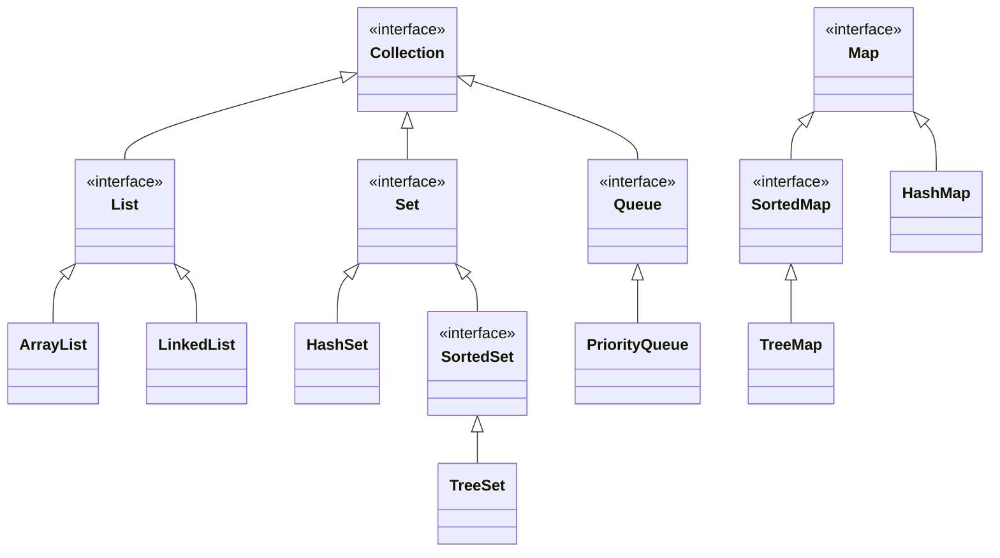

# Module 04 Team Activity - Java Collections Framework

For this activity, we are going to explore the collections framework, and how to manipulate data structures with the Stream object. 

## Grading
Grades for team activities will be based on attendance and notes. You must attend, and as a team you need to generate notes that we can confirm your work. Ideally, you upload the notes as a PDF to the Canvas assignment. 

> [!TIP] 
> Good notes become a study guide for you and your team! Make sure they include everything you need to help better understand the weekly material. 

### ⭐ Working in Teams ⭐
When working in teams, remember do not let one person do all the work. Make sure to work together, and ask questions. It is also better if different people program, and you all take turns programming for various team assignments.

## Learning Objectives
This team activity is designed to help you understand the following concepts:
- How to use the Collections Framework
- Key Data Structures in Java
- Understanding Polymorphism to simplify your code
- How to use the Stream object to:
  - manipulate data structures
  - filter data
  - sort data
  - map data
  - reduce data


## Collections Framework

Java quickly gained in popularity since it came out in 1996 due to three major features. The first was built-in garbage collection. One of the troublesome aspects of programming in C is the allocation and deallocation of memory. In Java, a developer had a C-like language that managed memory automatically. The second was that it was advertised to write once, and run on every machine. The third was an extensive API of classes that "shipped" with the Java Development Kit (JDK). These are now called the [Java Core Libraries].


Of the core libraries, the Collections Framework is one of the most used. It is a set of classes and interfaces that implement commonly reusable data structures.  In Python, you know of List and Dictionary, those are both data structures. In Java, you have a similar set of data structures, though as expected, types are strictly enforced.

The Collections Framework has the following interfaces and associated classes:


In the above diagram, the interfaces make up much of the framework, with only a sample of classes being listed for each item. Technically, classes like `LinkedList` implement both `List` and `Queue`, so the framework isn't as simple as the diagram above.  Java has extensive documentation on [Collections].

For a comparison between Python and Java, dictionaries, lists and sets in Python are like maps, lists and sets in Java.  


> [!NOTE]
> For more details beyond this course a good tutorial can be found at [Java Collections: The List Interface](https://stackabuse.com/java-collections-the-list-interface/), the official [Java Core Libraries](https://docs.oracle.com/en/java/javase/21/core/java-core-libraries1.html), and also the tutorial at [dev.java: The Collections Framework](https://dev.java/learn/api/collections-framework/). 


### 👉🏽 Discussion
Thinking back to your CS 5001 class, what were some cases to use a List or Dictionary in Python? The Collections framework is a bit more detailed in giving you more control of the underlying data structure, but the fundamentals are similar. 


<!-- Links -->
[Java Core Libraries]: https://docs.oracle.com/en/java/javase/21/core/java-core-libraries1.html
[Collections]: https://docs.oracle.com/en/java/javase/21/docs/api/java.base/java/util/package-summary.html#JavaCollectionsFramework

### The power of inheritance and polymorphism
When you are programming, you need to know which collection to use. The details of the types
of data structures are covered more in CS 5008, but it is worth seeing the differences between them. 

Look for [ListRunner.java](ListRunner.java). The file is a simple program that shows
two major concepts.

1) Why you often want to declare to the interface, and not the specific object in your code.
2) Knowing what you want to do, and picking the data structure that fits your needs is a drastic difference. 


> [!TIP]
> An ArrayList uses an array under the scenes. As a reminder, an array is a fixed size of multiple objects, and if you exceed the size, you need to create a new array and copy the data over. An ArrayList does this for you, constantly resizing the underlying array as needed. It gives you the advantages of an array (direct memory access) without needing to track sizes and limitations. 
>
> A LinkedList is something you cover in more detail in CS 5008, but it is a series of nodes that point to the next node. This allows for quick insertions and deletions, but slower access times. 


### ListRunner.java methods

Take a look at ListRunner.java.  👉🏽 DISCUSS and define as a group what the following two methods do
* runAddToFrontTest(List<Integer> list)
* accessNthElement(List<Integer> list, int n)

### :fire: Task 1: Run ListRunner.java

Either in your IDE or via the command line, run ListRunner.java. If you are using the command line/terminal, you can run the following commands. 

```bash
cd Part1  #(or wherever you have the files)
javac ListRunner.java
java ListRunner
```
`javac` is the Java compiler and `java` is a program to run compiled Java code. The last step (running the code) run may take over a minute or so, so be patient. 

👉🏽 DISCUSS the results! 

A powerful concept is that if your entire program uses List, you often only have one spot to change the class. A simple change between `ArrayList` and `LinkedList` can make a big difference in the run time depending on what the code has been programmed to do. 

## Streams
Introduced in Java 8, the Stream object is a powerful way to manipulate data structures. It is a way to process data in a functional way, and can be used to filter, sort, map, and reduce data. Modern languages will often start with streams as part of their data structures, but due to Java's history it wasn't added until a bit later in the design. 

Traditionally, if I wanted to filter a list of numbers, I would have to write a loop to go through the list, and then add the numbers that met the criteria to a new list. 

The code would be the following:

```java
import java.util.ArrayList;
import java.util.List;
import java.util.Arrays;

public class YourClassName {
    public static List<Integer> getEvens(List<Integer> numbers) {
        List<Integer> evens = new ArrayList<>();
        for(int i = 0; i < numbers.size(); i++){
            if(numbers.get(i) % 2 == 0){
                evens.add(numbers.get(i));
            }
        }
        return evens;
    }

    public static void main(String[] args) {
        List<Integer> numbers = Arrays.asList(1,2,3,4,5,6,7,8,9,10); // this function is a quick way to build a list
        List<Integer> evens = getEvens(numbers);
        System.out.println(evens);
    }
}
```

### :fire: Task: Practice 
Go ahead and create a solution/Java file, and put in the above code. Make sure to change YourClassName to match the **descriptive** name of the .java file you create. Throughout this Module you will continue to add to this file.

### Streams Example

Now, let's try the same example in a more modern way using the Stream object. 

```java
import java.util.ArrayList;
import java.util.List;
import java.util.Arrays;
import java.util.stream.Collectors;

public class YourClassName {
    public static void main(String[] args) {
        List<Integer> numbers = Arrays.asList(1,2,3,4,5,6,7,8,9,10); // this function is a quick way to build a list
        List<Integer> evens2 = numbers.stream().filter(n -> n % 2 == 0).collect(Collectors.toList());
        System.out.println(evens2);
    }
}
```

Try the above code. 👉🏽 DISCUSS the results!

In English, the code says:
1. Take the list of numbers as a stream
2. Filter the stream to only include numbers that are even
3. Collect the stream of even numbers into a list

For the remainder of this TeamActivity, you will continue to build on your test file. While we have a solution, it is best for you all to work on your own versions and look towards the solution if stuck. 


### :fire: Task: Reduce

The following code is an example of using a stream to "reduce" the results into a single value or set of items.

```java
List<Integer> integers = Arrays.asList(1, 2, 3, 4, 5);
Integer sum = integers.stream().reduce(0, (a, b) -> a + b);
```

:fire: Task - Write a method that does the same thing. It (a) takes in a list of Integers, and (b) returns the sum of the list.


### :fire: Task: Map

The following code is an example of using a stream to "map" the results into a new set of items.

```java
List<Integer> integers = Arrays.asList(1, 2, 3, 4, 5);
List<Integer> squared = integers.stream().map(n -> n * n).collect(Collectors.toList());
``` 
Notice that the map takes a function (technically called a lambda function) that takes in a single value and returns a single value *for each* value in the list. It then collects the results back into a list.

:fire: Task - Write a method that does the same thing. It (a) takes in a list of Integers, and (b) returns a list of the squares of the list.

#### A bit harder examples

A key idea about map, is that the built list can be any type. So let's say you have a list of strings, and you want to convert the information into a new data class. 

The data class is as follows:

```java
class Book {
    private String title;
    private String author;
    private int year;

    public Book(String title, String author, int year){
        this.title = title;
        this.author = author;
        this.year = year;
    }

    public String getTitle(){
        return title;
    }

    public String getAuthor() {
        return author;
    }

    public int getYear() {
        return year;
    }

    public static Book createFromString(String line) {

        String[] parts = line.split(",");
        return new Book(parts[0], parts[1], Integer.parseInt(parts[2])); 
        // the above case is simple, often try/catch statements would be good!
    }

}
```

I have a list of strings that are in the format "title,author,year". I want to convert this list of strings into a list of Book objects. 

```java
List<String> bookStrings = Arrays.asList("The Great Gatsby,F. Scott Fitzgerald,1925",
                "To Kill a Mockingbird,Harper Lee,1960",
                "1984,George Orwell,1949",
                "The Catcher in the Rye,J.D. Salinger,1951",
                "Beloved,Toni Morrison,1987");
List<Book> books = bookStrings.stream().map(Book::createFromString).collect(Collectors.toList());

```

The above code is a bit more complex, but it shows how you can use the map function to convert one type of object into another across an entire list of objects. 

:fire: Task - Write a method that does the same thing. It (a) takes in a list of Strings, and (b) returns a list of Book objects. You can use [Book.java](Book.java) provided with this team activity. 


> [!TIP]
> The createFromString method is a factory method similar to what you saw in Module 03. In this
> context it helps reduce the overhead of converting the CSV string to a Book object.
> A more complicated example may be pulling methods from another file that helps
> manipulate the data more before it gets mapped back to a new object.


## Sorting Items
Sorting items in a list, requires that the type of item being sorted implements the `Comparable` interface. This interface has a single method called `compareTo` that returns a negative number if the current object is less than the object being compared to, 0 if they are equal, and a positive number if the current object is greater than the object being compared to. By implementing `Comparable`, the sort method can be used to sort the list. 

```java

List<Integer> unsorted = Arrays.asList(5, 3, 1, 2, 4);
List<Integer> sorted = unsorted.stream().sorted().collect(Collectors.toList());
System.out.println(sorted);
```

The above code will sort the list of integers. However, as a group discuss what would happen if you tried to sort a list of Book objects. 

:fire: Task - Go ahead and write code that sorts the books. Since comparable is implemented, you can use code similar to the above to sort the books. You do not have to (and should not) write your own sort.


## 👉🏽  Discussion

Take a moment to discuss the various methods you wrote verse the stream functionality. What are the advantages and disadvantages of each? Can you think of other ways to test / apply the functionality. For example, maybe write a filter (see the first example) that filters the books that were published after 1950. Or write a filter that only takes odd numbers, but then adds those odd numbers together (reduce) . This last one combines the various methods you have learned so far, and you can 'chain' them together. We encourage you to work as a team to figure it out. 

Do you have to be an expert in Streams? No, not at all! But it does help to know what to look for to better understand the tools you have for the situation!


## :fire: Java Practice Problem
As part of **every** team activity, we will ask you to work on a Java Practice problem, and submit the code to the team files section (or as part of your notes). This is meant to give you practice similar to technical interviews, but also help build up your java skills. **Each team member needs to select a different problem!** But you can share/and should share answers and help each other. Remember, to learn a new language, the best thing you can do is practice! Here are some resources to find practice problems but you are not limited to them:


* [CodeHS - Java Practice](https://codehs.com/practice/java)
* [Coding Bat - Java](https://codingbat.com/java)
* [Hacker Rank - Java(Basic)](https://www.hackerrank.com/domains/java?filters%5Bskills%5D%5B%5D=Java%20%28Basic%29)
